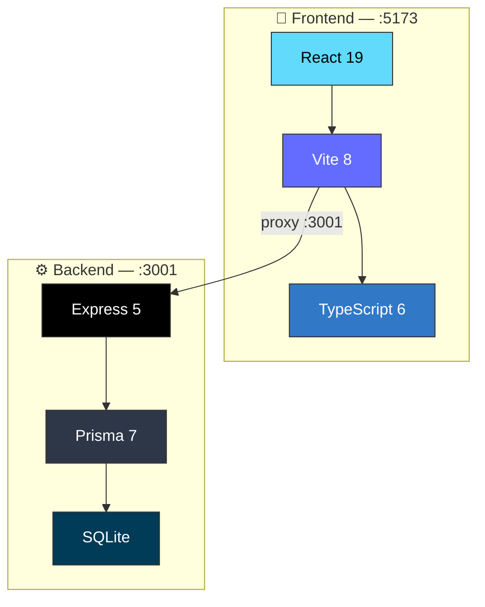

<div align="center">

# 🏗️ Presupuesto 3 Baños

**Sistema Integral de Presupuestación para Remodelación de Tres Áreas Húmedas**  
📍 Bogotá, Colombia · 📅 Junio 2026 · 🏢 Reserva de Granada 3

<!-- BADGES ROW 1 -->
[](https://react.dev)
[](https://vitejs.dev)
[](https://www.typescriptlang.org)
[](https://expressjs.com)

<!-- BADGES ROW 2 -->
[](https://www.prisma.io)
[](https://www.sqlite.org)
[](LICENSE)

<!-- HERO STATS -->
<br>

| | | | | | |
|---|---|---|---|---|---|
| 🏗️ **13** Capítulos | 📋 **69** Ítems | 📊 **55** APUs | 🔩 **384** Componentes | 🚿 **3** Baños | 📑 **5** Reportes |

<br>

</div>

---

## 📋 Descripción del Proyecto

> **Sistema completo de presupuestación** para la **rehabilitación integral de tres áreas húmedas** en el Conjunto Residencial **Reserva de Granada 3**, ubicado en la Calle 78 B No. 120-49, Bloque 1, Apto 401, Bogotá.

La aplicación cubre **todo el ciclo de vida del presupuesto**: desde la demolición de acabados existentes hasta los acabados finales, incluyendo instalaciones hidrosanitarias, eléctricas, drywall, impermeabilización, enchapes en porcelanato, aparatos sanitarios, carpintería, accesorios y transporte.

> 🎯 **Objetivo:** Proveer una herramienta interactiva de código abierto para la elaboración de presupuestos de obra civil bajo el esquema **CD + AIU** (Costo Directo + Administración 15% + Utilidad 10% + IVA 19% sobre utilidad), con precios de referencia **Homecenter Colombia — Junio 2026**.

---

## 🎯 Stack Tecnológico

<div align="center">



</div>

| Capa | Tecnología | Propósito |
|:---|:---|---|
| 🎨 **Frontend** | React 19 + Vite 8 + TypeScript 6 | Interfaz reactiva con 4 tabs + dashboard |
| ⚙️ **API** | Express 5 + Prisma 7 | CRUD completo + generación de reportes MD/HTML |
| 🗄️ **Base de datos** | SQLite (via Better-SQLite3 + Prisma Adapter) | Persistencia local cero-config |
| 🔄 **Proxy** | Vite dev server → `localhost:3001` | Comunicación integrada frontend-backend |

---

## ✨ Funcionalidades

<details open>
<summary><b>🏠 Dashboard con Resumen Financiero</b></summary>

- **Panel de control** con 3 tarjetas: Costo Directo, AIU, Precio Venta
- **Barra de composición** visual: CD / Admin / Utilidad / IVA con porcentajes
- **4 tabs** de navegación: Presupuesto, APU's, Insumos, Informes

</details>

<details open>
<summary><b>📋 Presupuesto — CRUD Inline Completo</b></summary>

- Tabla de ítems **agrupada por capítulo** con 7 columnas (Ítem, Actividad, Und, Cant, Vr/Unit, Vr/Total, TOTAL)
- **Edición inline**: edita cualquier campo directamente en la tabla
- **Creación/eliminación** de ítems con recálculo automático de totales
- Cada ítem se vincula a un **APU** para calcular costo unitario + AIU
- Cantidades **por baño** (ItemQuantity → Room)

</details>

<details open>
<summary><b>📊 APU's — Análisis de Precios Unitarios</b></summary>

- **55 APUs** con desglose completo de insumos (MO, MATERIAL, EQUIPO, TRANSPORT)
- **Expansión inline** para ver componentes de cada APU
- **CRUD** completo de APUs y sus componentes
- **AIU automático**: al modificar componentes se recalcula admin, utilidad e IVA
- **Códigos auto-generados** para insumos (MO-01, MA-01, EQ-01, TR-01)

</details>

<details open>
<summary><b>📦 Catálogo de Insumos</b></summary>

- Vista agrupada por categoría: Mano de Obra, Materiales, Equipo, Transporte
- Cantidades totales agregadas por insumo (sumando todos los APUs × cantidades de obra)
- Costo Directo + AIU + Valor Total por insumo

</details>

<details open>
<summary><b>📑 5 Reportes Profesionales</b></summary>

| # | Reporte | Descripción | Formato |
|:---:|---|---|---|
| 1 | 📊 **Presupuesto General** | Tabla capitulada con TOTAL GENERAL diseñado | MD / HTML |
| 2 | 📋 **APUs Detallados** | 55 APUs con insumos, composición %, AIU completo | MD / HTML |
| 3 | 📦 **Catálogo de Insumos** | Costos agregados por insumo (MO, Mat, Eq, Trans) | MD / HTML |
| 4 | 📐 **Memoria de Cantidades** | Dimensiones, áreas netas de muros, cálculo de cantidades | MD / HTML |
| 5 | 📝 **Especificaciones Técnicas** | 13 capítulos con normas, métodos constructivos, unidad de pago | MD / HTML |

</details>

<details open>
<summary><b>🖨️ Impresión Profesional</b></summary>

- **Ventana nueva** con estilos B/W optimizados para papel
- **`<thead>` repetido** en cada página (`table-header-group`)
- **`print-color-adjust: exact`** preserva fondos y colores
- Filas de capítulos con fondo gris, letra negrita, border-left 3px
- **TOTAL GENERAL**: fondo gradiente oscuro con tipografía blanca
- **Footer profesional**: Ingeniero a cargo con datos de contacto

</details>

<details open>
<summary><b>⚙️ Administración de Capítulos</b></summary>

- Componente **AdminChapters** para crear, editar y reordenar capítulos
- Soporte para iconos personalizados (emojis)
- Validación de código único y eliminación segura (bloquea si hay ítems asociados)

</details>

---

## 💰 Resumen Financiero

<div align="center">

### Costo Directo

| Componente | Valor | % del CD |
|:---|---:|---:|
| 👷 **Mano de Obra** | $7.963.045 | 36.9% |
| 🧱 **Materiales** | $11.242.181 | 52.1% |
| 🔧 **Equipo** | $836.126 | 3.9% |
| 🚚 **Transporte** | $1.539.614 | 7.1% |
| **💵 Costo Directo Total** | **$21.580.967** | **100%** |

### AIU — Administración, Utilidad e IVA

| Componente | Tasa | Valor |
|:---|---:|---:|
| 📋 **Administración** | 15% | $3.237.138 |
| 💼 **Utilidad** | 10% | $2.158.097 |
| 🧾 **IVA sobre Utilidad** | 19% | $410.127 |
| **📊 Total AIU** | | **$5.805.382** |

<!-- VISUAL BAR -->

```
┌─────────────────────────────────────────────────────────────────┐
│  CD ████████████████████████████████████████████████████████████ 79% │
│  Adm ██████████ 12%  │  Util ███████ 8%  │  IVA ██ 1%  │
└─────────────────────────────────────────────────────────────────┘
```

### 🏆 Precio Venta

| | |
|:---|---:|
| **💵 Costo Directo** | $21.580.967 |
| **📊 AIU** | $5.805.382 |
| | |
| **🏆 VALOR TOTAL DEL PRESUPUESTO** | **$27.386.349 COP** |
| | **≈ USD 6.850*** |

<sub>\*Tasa de referencia aproximada $4.000 COP/USD. Precios Homecenter Colombia Junio 2026.</sub>

</div>

---

## 📐 Dimensiones de los Baños

| Baño | Ancho | Largo | Altura | Área Piso | Perímetro | Área Muros Neta | Ducha |
|:---|:---:|:---:|:---:|:---:|:---:|:---:|:---:|
| 🚿 **B1** | 1.20 m | 1.50 m | 2.20 m | 1.80 m² | 5.40 m | 10.42 m² | ❌ |
| 🚿 **B2** | 1.25 m | 2.15 m | 2.22 m | 2.69 m² | 6.80 m | 13.50 m² | ✅ |
| 🚿 **B3** | 1.25 m | 2.15 m | 2.20 m | 2.69 m² | 6.80 m | 13.50 m² | ✅ |
| **Total** | | | | **7.18 m²** | | **37.42 m²** | **2** |

> **Nota:** El área neta de muros descuenta puertas (0.65×2.00m = 1.30 m²) y ventanas (0.40×0.40m = 0.16 m²). Altura de entrepiso estándar Bogotá: 2.20 m.

---

## 🏗️ 13 Capítulos de Obra — Desglose Completo

<div align="center">

| # | Icono | Capítulo | Costo Directo | % CD |
|:---:|:---:|---|---:|---:|
| **C01** | 🔨 | Demolición y Desmonte | $1.759.351 | 8.2% |
| **C02** | 💧 | Instalaciones Hidráulicas | $1.323.009 | 6.1% |
| **C03** | ⚡ | Instalaciones Eléctricas | $1.308.000 | 6.1% |
| **C04** | 🧱 | Muros y Pañetes | $1.171.192 | 5.4% |
| **C05** | 🎨 | Cieloraso en Drywall y Pintura | $523.851 | 2.4% |
| **C06** | 🛡️ | Impermeabilización | $442.140 | 2.0% |
| **C07** | ✨ | Enchapes y Pisos en Porcelanato | **$5.104.995** | **23.7%** |
| **C08** | 🚽 | Aparatos Sanitarios y Griferías | **$4.566.000** | **21.2%** |
| **C09** | 🔧 | Carpintería | $286.501 | 1.3% |
| **C10** | 🪞 | Accesorios y Varios | $2.132.006 | 9.9% |
| **C11** | 🧹 | Aseo y Finales | $972.000 | 4.5% |
| **C12** | 🚚 | Transporte y Logística | $1.308.000 | 6.1% |
| **C13** | 🪟 | Ventanas | $684.000 | 3.2% |
| | | **TOTAL** | **$21.580.967** | **100%** |

</div>

### 📊 Distribución Visual del Presupuesto

```
C07 ████████████████████████████████████████████████████████████ 23.7%
C08 ███████████████████████████████████████████████████████    21.2%
C10 ████████████████████████████                              9.9%
C01 ███████████████████████                                   8.2%
C02 ███████████████████                                       6.1%
C03 ███████████████████                                       6.1%
C12 ███████████████████                                       6.1%
C04 █████████████████                                         5.4%
C11 ███████████████                                           4.5%
C13 ████████████                                              3.2%
C05 ███████                                                   2.4%
C06 ██████                                                    2.0%
C09 ████                                                      1.3%
```

---

## 📂 Estructura del Proyecto

```
06-Apto_Suegros/
│
├── 📁 server/                        # 🖥️ Backend API
│   └── 📄 index.ts                   #     Express 5 — CRUD completo + reportes
│
├── 📁 src/                           # 🎨 Frontend React
│   ├── 📁 components/
│   │   ├── 📄 Presupuesto.tsx        #     Tabla capítulos/ítems + CRUD inline
│   │   ├── 📄 APUs.tsx               #     Análisis de Precios Unitarios
│   │   ├── 📄 Insumos.tsx            #     Catálogo de insumos agrupado
│   │   ├── 📄 MemoriaDeCalculo.tsx   #     5 reportes profesionales + impresión
│   │   └── 📄 AdminChapters.tsx      #     CRUD de capítulos
│   ├── 📄 api.ts                     #     Interfaces + fetchJSON/sendJSON
│   ├── 📄 App.tsx                    #     4 tabs + dashboard + footer
│   └── 📄 App.css                    #     Estilos: glassmorphism, grid, animaciones
│
├── 📁 prisma/                        # 🗄️ Base de datos
│   ├── 📄 schema.prisma              #     8 modelos (Unit, Room, Chapter, ...)
│   ├── 📄 seed.ts                    #     55 APUs · 69 items · 13 capítulos
│   └── 🗄️ dev.db                    #     SQLite con datos semilla
│
├── 📁 informes/                      # 📑 Documentación técnica PDF
│   ├── 📄 00-Justificacion_Remodelacion.pdf   # 🏆 141 páginas (completo)
│   ├── 📄 01-Presupuesto_General.pdf
│   ├── 📄 02-APUs_Detallados.pdf
│   ├── 📄 03-Insumos.pdf
│   ├── 📄 04-Memoria_Cantidades.pdf
│   └── 📄 05-Especificaciones_Tecnicas.pdf
│
├── 📁 reports/                       # 📝 Markdown base para reportes
├── 📄 AGENTS.md                      # Contexto completo para asistentes AI
├── 📄 package.json
├── 📄 tsconfig.json
└── 📄 vite.config.ts
```

---

## 🚀 Instalación y Uso

### 📥 Prerrequisitos

```
🟢 Node.js ≥ 22
🟢 npm ≥ 10
```

### ⚙️ Instalación

```bash
# 1. Clonar el repositorio
git clone https://github.com/gcorrea2005/06-Apto_Suegros.git
cd 06-Apto_Suegros

# 2. Instalar dependencias
npm install

# 3. Inicializar base de datos (crea tablas + datos semilla)
npx prisma db push --force-reset
npx prisma generate
npx tsx prisma/seed.ts
```

### 🖥️ Desarrollo (dos terminales)

```bash
# Terminal 1 — API Server
npm run dev:server
# → http://localhost:3001

# Terminal 2 — Frontend
npm run dev:client
# → http://localhost:5173
```

> 💡 **Tip:** Usa `npm run dev` para correr ambos simultáneamente con `concurrently`.

### 🏗️ Build de Producción

```bash
npm run build
npm run preview
```

### 🛠️ Comandos Útiles

| Comando | Descripción |
|:---|---|
| `npm run dev:server` | API Express en `:3001` con hot-reload (tsx watch) |
| `npm run dev:client` | Vite dev server en `:5173` |
| `npm run dev` | Ambos servidores simultáneos |
| `npm run build` | Compilación TypeScript + Vite build |
| `npm run lint` | ESLint en todo el proyecto |
| `npx prisma studio` | GUI para explorar la base de datos |
| `npx prisma db push --force-reset` | Regenerar BD desde schema |
| `npx tsc --noEmit` | Verificar tipos TypeScript |

---

## 📄 Documento Técnico

El informe completo de **141 páginas** se encuentra en:

```
📁 informes/00-Justificacion_Remodelacion.pdf
```

### Contenido del Documento

| Sección | Páginas | Contenido |
|:---:|:---:|---|
| **1** | 1-8 | 📝 **Introducción** — Contexto, objetivos generales y específicos |
| **2** | 9-22 | 🔍 **Diagnóstico** — Estado actual de los 3 baños, patologías identificadas |
| **3** | 23-35 | 📋 **Alcance del Proyecto** — 13 capítulos de obra detallados |
| **4** | 36-72 | 🏛️ **Justificación Técnica** — NSR-10, microzonificación sísmica, geotecnia, morteros, asentamientos diferenciales, deformaciones, humedad capilar, fichas técnicas |
| **5** | 73-92 | 💰 **Justificación Económica** — Presupuesto detallado, AIU, análisis costo-beneficio, viabilidad financiera |
| **6** | 93-105 | 📅 **Cronograma** — Diagrama de Gantt (5 semanas), ruta crítica |
| **7** | 106-112 | ✅ **Conclusiones y Recomendaciones** |
| **8** | 113-135 | 📎 **Anexos** — 5 documentos técnicos completos |
| **Ref** | 136-141 | 📚 **Bibliografía** — 30 referencias (NTC, ASTM, ISO, NSR, decretos) |

---

## 🧪 API REST — Endpoints

### Unidades y Salas

| Método | Ruta | Descripción |
|:---:|---|---|
| `GET` | `/api/units` | Lista unidades (m², und, ml, pto, gl...) |
| `GET` | `/api/rooms` | Lista los 3 baños con dimensiones |
| `GET` | `/api/chapters` | 13 capítulos ordenados |

### Gestión de Capítulos, Ítems y APUs

| Método | Ruta | Descripción |
|:---:|---|---|
| `POST` | `/api/chapters` | Crear capítulo |
| `PUT` | `/api/chapters/:code` | Editar capítulo |
| `DELETE` | `/api/chapters/:code` | Eliminar capítulo (si no tiene ítems) |
| `GET` | `/api/chapters/:code/items` | Ítems de un capítulo |
| `POST` | `/api/items` | Crear ítem (con cantidades por baño) |
| `PUT` | `/api/items/:id` | Editar ítem |
| `DELETE` | `/api/items/:id` | Eliminar ítem |
| `GET` | `/api/apus` | Lista 55 APUs con componentes |
| `POST` | `/api/apus` | Crear APU (con códigos auto-generados) |
| `PUT` | `/api/apus/:id` | Editar APU (recalcula AIU) |
| `DELETE` | `/api/apus/:id` | Eliminar APU |
| `POST` | `/api/apus/:apuId/components` | Agregar componente |
| `PUT` | `/api/apus/:apuId/components/:compId` | Editar componente |
| `DELETE` | `/api/apus/:apuId/components/:compId` | Eliminar componente |

### Reportes y Resumen

| Método | Ruta | Descripción |
|:---:|---|---|
| `GET` | `/api/budget/summary` | Dashboard: CD, AIU, PV, desglose MO/MAT/EQ/TR |
| `GET` | `/api/reports/:type?format=html` | Reportes en MD o HTML renderizado |

---

## 📜 Normas Técnicas Aplicables

<div align="center">

| Norma | Descripción | Aplicación |
|:---:|---|:---:|
| 🏛️ **NSR-10** | Reglamento Colombiano de Construcción Sismo Resistente | Supervisión técnica, cargas, demoliciones |
| ⚡ **RETIE** | Reglamento Técnico de Instalaciones Eléctricas | Instalaciones eléctricas en áreas húmedas |
| 💧 **RAS 2000** | Reglamento Técnico de Agua Potable y Saneamiento | Red hidráulica y sanitaria |
| 🔌 **NTC 2050** | Código Eléctrico Colombiano | Tomas GFCI, circuitos |
| 🧱 **NTC 4321** | Baldosas cerámicas — Especificaciones | Enchape porcelanato |
| 🚽 **NTC 179** | Aparatos sanitarios de cerámica | Sanitarios, lavamanos |
| 🚿 **NTC 2186** | Grifería para baño | Grifería mezcladora |
| 🧱 **NTC 5618** | Placas de yeso (drywall) | Cieloraso en drywall |
| 🛡️ **NTC 3184** | Membranas impermeabilizantes | Impermeabilización de pisos |
| 🪟 **NTC 4425** | Ventanas de aluminio | Ventanas |
| 🪟 **NTC 1522** | Vidrio para construcción | Divisiones de ducha |
| 🇺🇸 **ASTM C1396** | Standard Specification for Gypsum Board | Placa de yeso |
| 🇺🇸 **ASTM D6083** | Standard for Liquid Applied Acrylic Coating | Membrana acrílica |
| 🌐 **ISO 13007** | Ceramic tiles — Grouts and adhesives | Pegantes y boquillas |
| 📜 **Decreto 1077/2015** | Gestión de Residuos de Construcción y Demolición | Manejo de RCD |
| 📜 **Decreto 523/2010** | Microzonificación Sísmica de Bogotá | Amenaza sísmica |

</div>

---

## 📸 Capturas de Pantalla

> *Las imágenes ilustrativas representan la aplicación en funcionamiento.*

<details>
<summary><b>🖼️ Vista previa del Dashboard</b></summary>

```
┌─────────────────────────────────────────────────────────────────┐
│  🏗️ Presupuesto 3 Baños                                       │
│  Remodelación completa · Bogotá, Colombia                       │
│                                                                 │
│  [Presupuesto] [APU's] [Insumos] [Informes]                     │
│                                                                 │
│  ┌──────────────┐  ┌──────────────┐  ┌──────────────────────┐  │
│  │ Costo Directo │  │ AIU          │  │   Precio Venta        │  │
│  │ MO   $7.96M   │  │ Adm  $3.24M  │  │   $27.386.349         │  │
│  │ Mat  $11.24M  │  │ Util $2.16M  │  │   ┌─┬──┬───┬─┐        │  │
│  │ Eq   $836K    │  │ IVA  $410K   │  │   │C│A│U│I│        │  │
│  │ Trans $1.54M  │  │              │  │   └─┴──┴───┴─┘        │  │
│  │ Total $21.58M │  │ Total $5.81M │  │   79% 12% 8% 1%      │  │
│  └──────────────┘  └──────────────┘  └──────────────────────┘  │
└─────────────────────────────────────────────────────────────────┘
```

</details>

---

## 🤝 Contribuciones

Las contribuciones son bienvenidas y apreciadas:

1. 🍴 Fork el proyecto
2. 🌿 Crea una rama (`git checkout -b feature/mejora-increible`)
3. 💾 Commit (`git commit -m 'feat: descripción clara del cambio'`)
4. 🚀 Push (`git push origin feature/mejora-increible`)
5. 🔀 Abre un Pull Request

> 📌 Por favor, asegúrate de que `npm run lint` y `npx tsc --noEmit` pasen antes de enviar tu PR.

---

## 👷‍♂️ Autor

<div align="center">

<br>

**Ing. Jorge Giovanni Correa Mejía**  
**Diseñador Estructural**

📧 [gcorrea2005@gmail.com](mailto:gcorrea2005@gmail.com)  
📱 **Cel.** 304 445 2987  
📍 **Bogotá, Colombia**  
🆔 **CC** 4.252.533

</div>

---

## 📄 Licencia

```
MIT License

Copyright (c) 2026 Jorge Giovanni Correa Mejía

Permission is hereby granted, free of charge, to any person obtaining a copy
of this software and associated documentation files...
```

---

<div align="center">

<br>

| | |
|:---|:---|
| 🏗️ | **Hecho con ❤️, ☕ y mucha 🎨 en Bogotá — Junio 2026** |
| 💰 | **Precios Homecenter Colombia** |
| 📜 | **Normas Técnicas Colombianas Vigentes** |

<br>

[](https://github.com/gcorrea2005/06-Apto_Suegros/commits/master)
[](https://github.com/gcorrea2005/06-Apto_Suegros)
[](https://github.com/gcorrea2005/06-Apto_Suegros)

</div>
