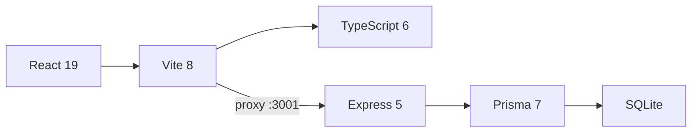

<div align="center">
  
# 🏗️ Presupuesto 3 Baños  

**App web full-stack para presupuesto de remodelación de 3 baños**  
📍 Bogotá, Colombia · 📅 Junio 2026  

[](https://react.dev)
[](https://vitejs.dev)
[](https://www.typescriptlang.org)
[](https://expressjs.com)
[](https://www.prisma.io)
[](https://www.sqlite.org)
[](LICENSE)

---

</div>

## 📋 Descripción

Sistema integral de presupuestación para la remodelación de **tres baños** en el Conjunto Residencial **Reserva de Granada 3** (Calle 78 B No. 120-49, Bloque 1, Apto 401). Incluye desde la demolición hasta los acabados finales, con:

<div align="center">

| 📐 | 📊 | 📄 |
|---|---|---|
| **13** Capítulos | **67** Ítems | **53** APUs |
| **~280** Componentes | **3** Baños | **5** Reportes |

</div>

---

## 🎯 Stack Tecnológico



| Capa | Tecnología | Versión |
|---|---|---|
| 🎨 **Frontend** | React + Vite + TypeScript | 19 / 8 / 6 |
| ⚙️ **Backend** | Express + Prisma | 5 / 7 |
| 🗄️ **Base de datos** | SQLite (Better-SQLite3) | — |
| 🔄 **Proxy** | Vite dev server | API → `:3001` |

---

## ✨ Funcionalidades

<details open>
<summary><b>🔧 Gestión de Presupuesto</b></summary>

- **Dashboard** con 4 tabs: Presupuesto, APUs, Insumos, Memoria de Cálculo
- **CRUD inline** de capítulos, ítems, APUs y componentes
- **AIU automático**: Administración 15% + Utilidad 10% + IVA 19% sobre utilidad
- **Códigos auto-generados** para insumos (MO-01, MA-01, EQ-01, TR-01)

</details>

<details open>
<summary><b>📑 Reportes Técnicos</b></summary>

| Reporte | Formato | Descripción |
|---|---|---|
| 📊 Presupuesto General | MD / HTML | Tabla 7 cols con capítulos y TOTAL GENERAL |
| 📋 APUs Detallados | MD / HTML | APU con insumos, composición %, AIU |
| 📦 Catálogo de Insumos | MD / HTML | Agrupado por categoría (MO, MATERIAL, EQUIPO, TRANSPORT) |
| 📐 Memoria de Cantidades | MD / HTML | Dimensiones baños, áreas, notas técnicas |
| 📝 Especificaciones Técnicas | MD / HTML | 13 capítulos con normas, métodos, unidades de pago |

</details>

<details open>
<summary><b>🖨️ Impresión Profesional</b></summary>

- Ventana nueva con estilos B/W optimizados
- `<thead>` se repite en cada página (`table-header-group`)
- `print-color-adjust: exact` preserva fondos
- Glass card en headers con `backdrop-filter: blur(12px)`

</details>

---

## 📂 Estructura del Proyecto

```
06-Apto_Suegros/
├── 📁 server/
│   ├── 📄 index.ts            # API REST (Express 5) + generación de reportes
│   └── ...
├── 📁 src/
│   ├── 📁 components/
│   │   ├── 📄 Presupuesto.tsx      # Tabla items por capítulo con CRUD inline
│   │   ├── 📄 APUs.tsx             # Lista APUs con expansión y CRUD
│   │   ├── 📄 Insumos.tsx          # Catálogo de insumos agrupado
│   │   └── 📄 MemoriaDeCalculo.tsx # 5 reportes con impresión
│   ├── 📄 api.ts               # Interfaces + fetchJSON/sendJSON
│   ├── 📄 App.tsx              # 4 tabs + dashboard
│   └── 📄 index.css            # Estilos globales
├── 📁 prisma/
│   ├── 📄 schema.prisma        # 8 modelos (Unit, Room, Chapter, Item, ...)
│   ├── 📄 seed.ts              # 53 APUs, 67 items, 13 capítulos
│   └── 🗄️ dev.db              # Base de datos SQLite
├── 📁 informes/
│   ├── 📄 00-Justificacion_Remodelacion.pdf   # 🏆 Documento completo (141 pág)
│   ├── 📄 01-Presupuesto_General.pdf
│   ├── 📄 02-APUs_Detallados.pdf
│   ├── 📄 03-Insumos.pdf
│   ├── 📄 04-Memoria_Cantidades.pdf
│   └── 📄 05-Especificaciones_Tecnicas.pdf
├── 📁 reports/                 # Markdown base para reportes
├── 📄 AGENTS.md                # Contexto completo del proyecto
├── 📄 package.json
└── 📄 vite.config.ts
```

---

## 🧮 Datos del Proyecto

<div align="center">

| Concepto | Valor |
|---|---|
| 👤 **Propietario** | Francisco Javier Rondon Lagos |
| 📍 **Dirección** | Calle 78 B No. 120-49, Bloque 1, Apto 401 |
| 🏙️ **Conjunto** | Reserva de Granada 3 · Bogotá |
| 🏢 **Edificio** | 12 pisos + parqueadero a nivel + 1 sótano |

</div>

### 📐 Dimensiones de los Baños

| Baño | Ancho | Largo | Altura | Área Piso | Área Muros | Ducha |
|---|---|---|---|---|---|---|
| 🚿 B1 | 1.20 m | 1.50 m | 2.20 m | 1.80 m² | 10.42 m² | ❌ |
| 🚿 B2 | 1.25 m | 2.15 m | 2.20 m | 2.69 m² | 13.50 m² | ✅ |
| 🚿 B3 | 1.25 m | 2.15 m | 2.20 m | 2.69 m² | 13.50 m² | ✅ |
| **Total** | | | | **7.18 m²** | **37.42 m²** | 2 |

### 💰 Resumen Financiero

<div align="center">

| Concepto | Valor |
|---|---|
| 💵 **Costo Directo** | **$21.580.967 COP** |
| 📊 **AIU** (Adm 15% + Util 10% + IVA 19%/util) | **$5.805.382 COP** |
| 🏆 **Valor Total** | **$27.386.349 COP** |

</div>

---

## 🏗️ 13 Capítulos de Obra

<div align="center">

| # | Capítulo | Costo Directo | % |
|---|---|---|---|
| 🔨 | **C01** Demolición y Desmonte | $1.759.351 | 8.2% |
| 💧 | **C02** Instalaciones Hidráulicas | $1.323.009 | 6.1% |
| ⚡ | **C03** Instalaciones Eléctricas | $1.308.000 | 6.1% |
| 🧱 | **C04** Muros y Pañetes | $1.171.192 | 5.4% |
| 🎨 | **C05** Cieloraso Drywall + Pintura | $523.851 | 2.4% |
| 🛡️ | **C06** Impermeabilización | $442.140 | 2.0% |
| ✨ | **C07** Enchapes y Pisos Porcelanato | **$5.104.995** | **23.7%** |
| 🚽 | **C08** Aparatos Sanitarios y Griferías | **$4.566.000** | **21.2%** |
| 🔧 | **C09** Carpintería | $286.501 | 1.3% |
| 🪞 | **C10** Accesorios y Varios | $2.132.006 | 9.9% |
| 🧹 | **C11** Aseo y Finales | $972.000 | 4.5% |
| 🚚 | **C12** Transporte y Logística | $1.308.000 | 6.1% |
| 🪟 | **C13** Ventanas | $684.000 | 3.2% |
| | **TOTAL** | **$21.580.967** | **100%** |

</div>

---

## 🚀 Instalación y Uso

### 📥 Prerrequisitos

- Node.js ≥ 22
- npm ≥ 10

### ⚙️ Instalación

```bash
# Clonar
git clone https://github.com/gcorrea2005/06-Apto_Suegros.git
cd 06-Apto_Suegros

# Dependencias
npm install

# Inicializar base de datos + seed
npx prisma db push --force-reset
npx prisma generate
npx tsx prisma/seed.ts
```

### 🖥️ Desarrollo

```bash
# Terminal 1: API Server → http://localhost:3001
npm run dev:server

# Terminal 2: Cliente → http://localhost:5173
npm run dev:client

# O todo en uno
npm run dev
```

### 🏗️ Producción

```bash
npm run build
npm run preview
```

---

## 📄 Documento Técnico

El informe completo se encuentra en:

```
📁 informes/00-Justificacion_Remodelacion.pdf
```

**141 páginas** con:

| Sección | Contenido |
|---|---|
| **1. Introducción** | Contexto del proyecto, objetivos |
| **2. Diagnóstico** | Estado actual de los 3 baños, patologías |
| **3. Alcance** | 13 capítulos de obra detallados |
| **4. Justificación Técnica** | Sísmica, geotecnia, morteros, asentamientos, deformaciones, humedad capilar |
| **5. Justificación Económica** | Presupuesto, AIU, análisis costo-beneficio |
| **6. Cronograma** | Diagrama de Gantt (5 semanas) |
| **7. Conclusiones** | Recomendaciones y cierre |
| **8. Anexos** | 5 documentos técnicos completos |
| **Bibliografía** | 30 referencias (NTC, ASTM, ISO, decretos) |

---

## 📜 Normas Técnicas Aplicables

<div align="center">

| Norma | Descripción |
|---|---|
| 🏛️ **NSR-10** | Reglamento Colombiano de Construcción Sismo Resistente |
| ⚡ **RETIE** | Reglamento Técnico de Instalaciones Eléctricas |
| 💧 **RAS 2000** | Reglamento Técnico de Agua Potable y Saneamiento |
| 🔌 **NTC 2050** | Código Eléctrico Colombiano |
| 🧱 **NTC 4321** | Baldosas cerámicas |
| 🚽 **NTC 179** | Aparatos sanitarios de cerámica |
| 🚿 **NTC 2186** | Grifería para baño |
| 🧱 **NTC 5618** | Placas de yeso (drywall) |
| 🛡️ **NTC 3184** | Membranas impermeabilizantes |
| 🪟 **NTC 4425** | Ventanas de aluminio |
| 🪟 **NTC 1522** | Vidrio para construcción |
| 🇺🇸 **ASTM C1396** | Gypsum Board |
| 🇺🇸 **ASTM D6083** | Liquid Applied Acrylic Coating |
| 🌐 **ISO 13007** | Ceramic tiles — Grouts and adhesives |
| 📜 **Decreto 1077/2015** | Gestión de RCD |
| 📜 **Decreto 523/2010** | Microzonificación Sísmica de Bogotá |

</div>

---

## 🤝 Contribuciones

Las contribuciones son bienvenidas. Por favor:

1. Fork el proyecto
2. Crea una rama (`git checkout -b feature/amazing`)
3. Commit (`git commit -m 'feat: algo increíble'`)
4. Push (`git push origin feature/amazing`)
5. Abre un Pull Request

---

## 👷‍♂️ Autor

<div align="center">

**Ing. Jorge Giovanni Correa Mejía**  
📧 gcorrea2005@gmail.com  
📍 Bogotá, Colombia

</div>

---

<p align="center">
  <sub>Hecho con ❤️, ☕ y mucha 🎨 en Bogotá — Junio 2026</sub><br>
  <sub>Precios Homecenter Colombia · Normas Técnicas Colombianas Vigentes</sub>
</p>

<div align="center">
  
[](https://github.com/gcorrea2005/06-Apto_Suegros/commits/master)
[](https://github.com/gcorrea2005/06-Apto_Suegros)
[](https://github.com/gcorrea2005/06-Apto_Suegros)

</div>
